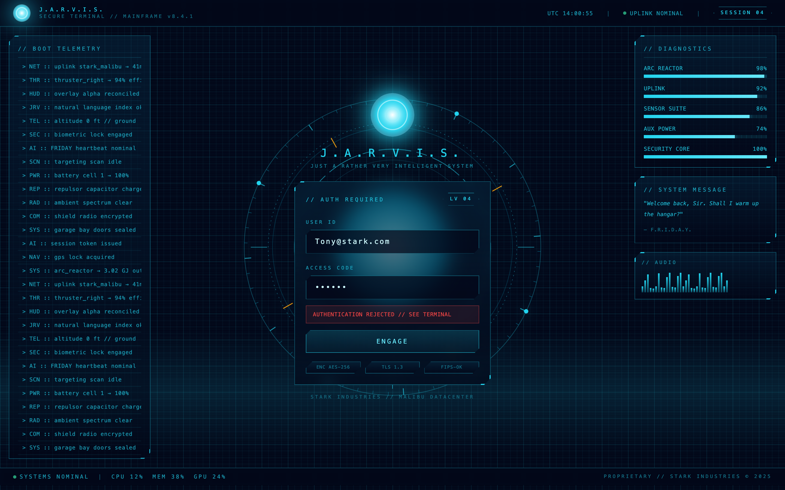
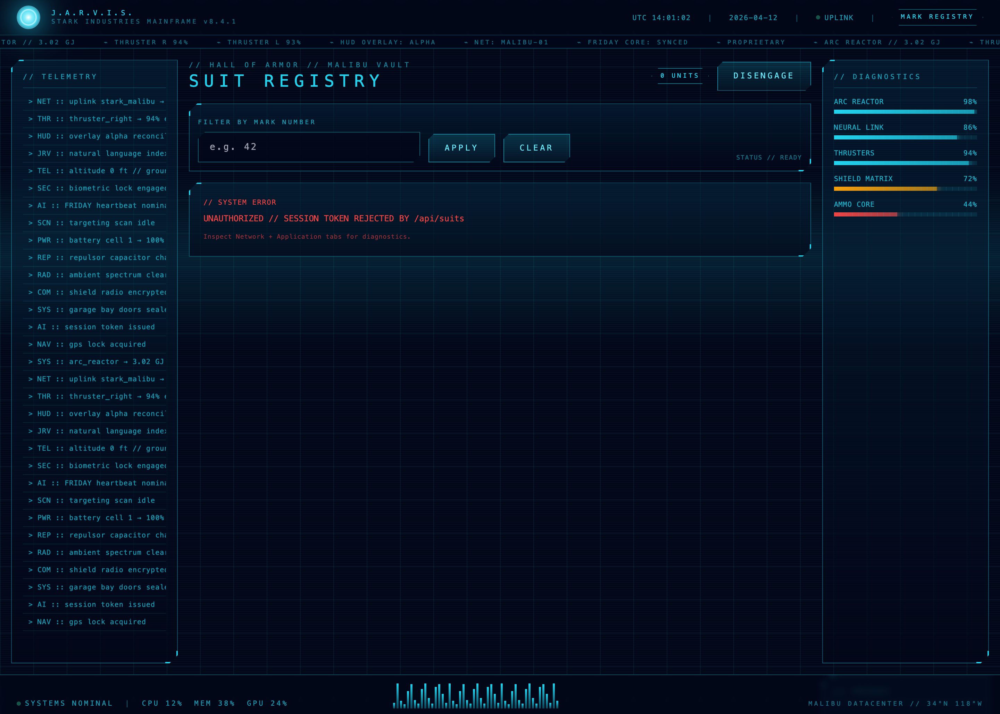
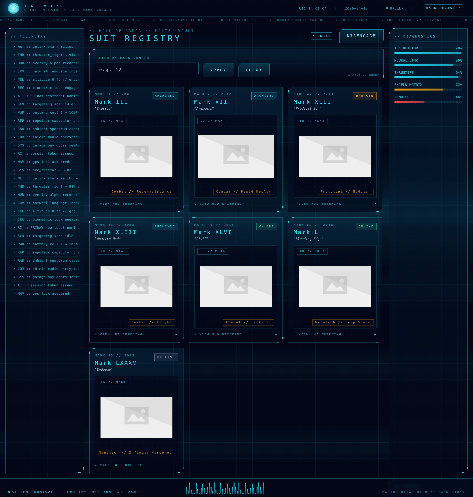
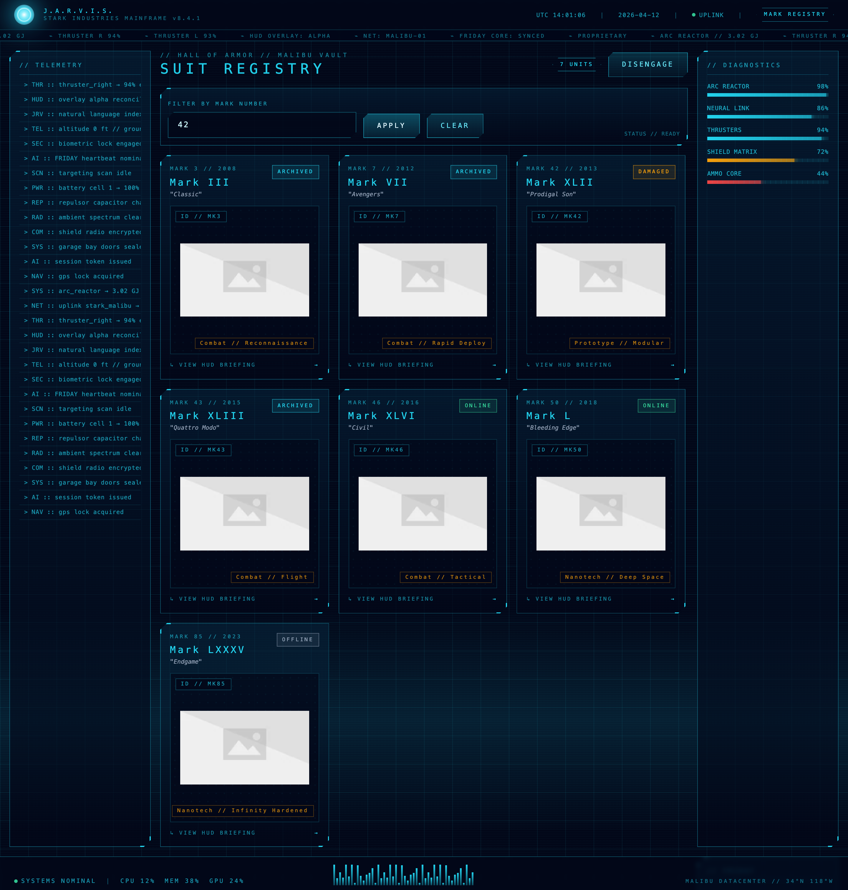
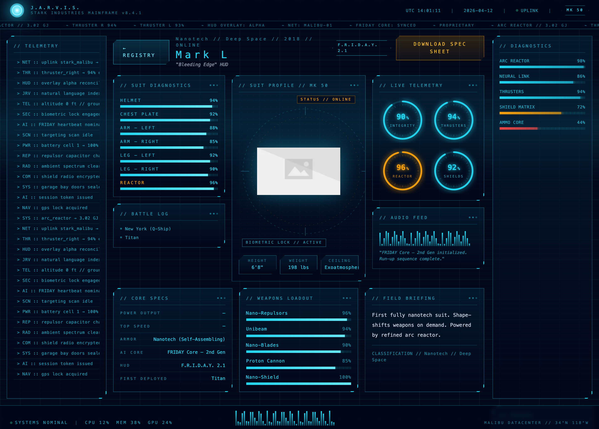
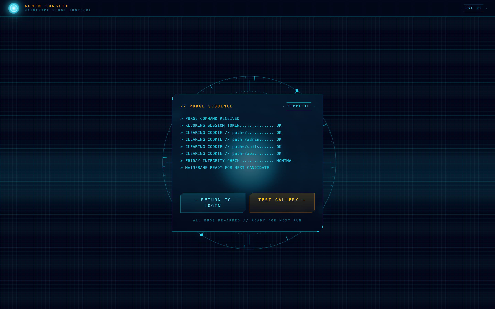

# Interview Walkthrough — Live Debugging Session

This doc walks through the entire interview flow with real screenshots captured against the production Vercel deploy.

**Target URL:** https://jarvis-nine-coral.vercel.app
**Credentials:** `tony@stark.com` / `jarvis` (case matters — see Bug L1)

Every screenshot below is captured from the live deploy. Every JSON blob is a real response body or request trace from a headless Chrome session. Nothing is mocked.

---

## API endpoints reference

| Method | Path | Purpose | Auth | Bug planted |
|---|---|---|---|---|
| `POST` | `/api/login` | Authenticate user, set session cookie | — | **L1** case-sensitive email, **L3** wrong cookie path |
| `POST` | `/api/logout` | Clear session cookie | — | none |
| `GET`  | `/api/suits` | List all suits (optional `?mark=N` filter) | Cookie required (401 otherwise) | none on backend — **S5** is in the frontend call site |
| `GET`  | `/api/suits/[id]` | Single suit detail by id (e.g. `mk50`) | Cookie required | none on backend — **S4** is in the frontend component |
| `GET`  | `/api/suits/[id]/spec` | CSV spec sheet download | Cookie required | **S1** missing `Content-Disposition` header |
| `POST` | `/api/admin/reset` | Purge `jarvis_session` cookie across paths | — | none (interviewer tool) |
| `POST` | `/api/admin/grant` | Bypass L1+L3: issue a valid session cookie at `Path=/` for `tony@stark.com` | — | none (interviewer tool) |

**Page routes (candidate-visible):**

| Path | What it is |
|---|---|
| `/` | J.A.R.V.I.S. boot + login HUD |
| `/suits` | Suit registry / gallery |
| `/suits/[id]` | Mark-level HUD with dials, integrity, weapons, specs |
| `/admin/reset` | Purge console (share only with yourself) |

**Sample curls for quick verification:**

```bash
URL=https://jarvis-nine-coral.vercel.app

# L1 — capital T returns 200 + EMAIL_CASE_MISMATCH
curl -s -X POST $URL/api/login \
  -H "Content-Type: application/json" \
  -d '{"email":"Tony@stark.com","password":"jarvis"}'

# L3 — check Set-Cookie has Path=/admin
curl -s -i -X POST $URL/api/login \
  -H "Content-Type: application/json" \
  -d '{"email":"tony@stark.com","password":"jarvis"}' \
  | grep -i set-cookie

# S1 — HEAD request shows no Content-Disposition (must be authed first)
COOKIE=$(curl -s -i -X POST $URL/api/login -H "Content-Type: application/json" \
  -d '{"email":"tony@stark.com","password":"jarvis"}' \
  | grep -i set-cookie | sed 's/.*jarvis_session=\([^;]*\).*/\1/')
curl -s -I -H "Cookie: jarvis_session=$COOKIE" $URL/api/suits/mk50/spec
```

---

## Step 1 — Landing page

Candidate visits the URL. After a short J.A.R.V.I.S. boot animation, the login HUD loads: arc reactor, concentric rings, telemetry stream (left), diagnostics bars (right), ticker (top), waveform (bottom).


Give the candidate the URL and credentials. Do not tell them emails are case-sensitive. Stay silent while they try.

---

## Step 2 — Bug L1 triggers (case-sensitive email)

Candidate types `Tony@stark.com` (capital T). Login fails with a generic UI error:



### What DevTools shows

Open Network tab, find `POST /api/login`, look at the Response. Status is **200 OK** — a trap. The body reveals the real failure:

```json
{
  "status": 200,
  "body": {
    "success": false,
    "error": "INVALID_CREDENTIALS",
    "detail": "EMAIL_CASE_MISMATCH: email comparison is case-sensitive on the server"
  }
}
```

### Expected candidate behavior
- Opens Network tab immediately. **Strong signal.**
- Inspects response body after seeing 200. **Staff-level signal.**
- Only looks at Console tab. **Weak.**
- Says "wrong password" and retries. **Red flag.**

### The fix (backend — `app/api/login/route.ts`)

```diff
- const user = USERS.find((u) => u.email === email && u.password === password);
+ const user = USERS.find(
+   (u) => u.email.toLowerCase() === String(email || "").toLowerCase()
+          && u.password === password,
+ );
```

---

## Step 3 — Lowercase login succeeds; Bug L3 triggers

Candidate retries with `tony@stark.com`. Login succeeds, redirects to `/suits`. But the gallery shows:



> UNAUTHORIZED // SESSION TOKEN REJECTED BY /api/suits

They just logged in. Why is the gallery 401?

### What DevTools shows

**Application tab → Cookies**:

```json
{
  "name": "jarvis_session",
  "value": "eyJlbWFpbCI6InRvbnlAc3RhcmsuY29tIiwibmFtZSI6IlRvbnkgU3RhcmsifQ....",
  "domain": "jarvis-nine-coral.vercel.app",
  "path": "/admin",          ← THE BUG
  "httpOnly": true,
  "sameSite": "Lax"
}
```

The cookie is set with **Path=`/admin`**. Browsers only attach a cookie to a request if the URL begins with that path. `/api/suits` doesn't start with `/admin`, so the browser silently drops the cookie. Server sees no auth.

**Network tab → `GET /api/suits` → Request Headers**: there's no `Cookie` header. Confirms the diagnosis.

### Expected candidate behavior
- Opens Network, sees 401, then opens Application → Cookies. **Good.**
- Notices the Path column. **Strong signal.**
- Understands cookie scoping (Path, SameSite, Secure). **Staff-level.**
- Blames the server without checking cookie attributes. **Red flag.**

### The fix (backend — `app/api/login/route.ts`)

```diff
  res.cookies.set(COOKIE_NAME, token, {
    httpOnly: true,
    sameSite: "lax",
-   path: "/admin",
+   path: "/",
    maxAge: 60 * 60 * 8,
  });
```

### Unblock live (without editing code)

DevTools → Application → Cookies → right-click `jarvis_session` → Edit → change Path from `/admin` to `/` → refresh. Candidate can continue to the gallery. Great for proving they actually understood the bug.

---

## Step 4 — Gallery loads (cookie manually fixed)

Once the cookie path is corrected, `GET /api/suits` carries the cookie, auth passes, and the full suit registry loads:



Seven suits: Mark III, VII, XLII, XLIII, XLVI, L, LXXXV. Each card shows mark number, year, name, codename, classification, and status (online/offline/damaged/archived).

---

## Step 5 — Bug S5 triggers (filter does nothing)

Candidate types `42` into the FILTER BY MARK NUMBER input and clicks APPLY. All seven suits still show:



### What DevTools shows

Network tab captures the request:

```json
{
  "urls": ["/api/suits?mark="],
  "note": "URL sent by filter button — note the empty mark value"
}
```

The query param is **empty**, not `42`. The filter never sent the typed value.

### Why
In `app/suits/page.tsx`:

```tsx
const [markInput, setMarkInput] = useState("");       // updates on keystroke
const [markApplied, setMarkApplied] = useState("");   // meant to update on Apply

function applyFilter(e: React.FormEvent) {
  e.preventDefault();
  loadSuits();   // ← never calls setMarkApplied(markInput)
}
```

`markInput` updates correctly on every keystroke. But `markApplied` (the one used to build the fetch URL) is never updated. Classic React state sync bug.

### Expected candidate behavior
- Opens Network, sees `mark=` empty. **Good.**
- Opens React DevTools, inspects state, spots `markApplied` never changes. **Strong.**
- Reads the `applyFilter` function in Sources. **Strong.**
- Concludes "backend filter is broken." **Red flag.**

### The fix (frontend — `app/suits/page.tsx`)

```diff
  function applyFilter(e: React.FormEvent) {
    e.preventDefault();
-   loadSuits();
+   setMarkApplied(markInput);
  }
+
+ useEffect(() => {
+   loadSuits();
+ }, [markApplied]);
```

The `useEffect` is needed because React batches state updates — calling `loadSuits()` inline right after `setMarkApplied(...)` would read the old value.

---

## Step 6 — Bug S4 triggers (snake_case vs camelCase)

Candidate clicks any suit card (e.g. Mark L). Detail page loads with a full HUD: integrity per body part, live telemetry dials, weapons loadout, battle log, core specs:



But in the **CORE SPECS** panel (bottom left), two rows are blank:
- **POWER OUTPUT** → (empty)
- **TOP SPEED** → (empty)

All other fields render fine. Narrow, specific failure.

### What DevTools shows

Network tab → `GET /api/suits/mk50` → Response Preview:

```json
{
  "success": true,
  "suit": {
    "id": "mk50",
    "mark": 50,
    "name": "Mark L",
    "power_output": "9.2 GW",      ← snake_case
    "top_speed": "Mach 4.0",       ← snake_case
    "armor": "Nanotech (Self-Assembling)",
    "ai_core": "FRIDAY Core — 2nd Gen",
    ...
  }
}
```

API payload uses **snake_case**. But the React component at `app/suits/[id]/page.tsx` reads:

```tsx
<SpecRow label="POWER OUTPUT" value={suit.powerOutput ?? "—"} />
<SpecRow label="TOP SPEED" value={suit.topSpeed ?? "—"} />
```

`suit.powerOutput` is `undefined` because the API never sends `powerOutput` (only `power_output`). The `?? "—"` fallback hides the bug with an em-dash.

### Expected candidate behavior
- Compares API payload shape (Network tab) with what UI displays. **Strong.**
- Notices snake_case vs camelCase mismatch. **Staff-level.**
- Only checks UI code, doesn't verify API payload. **Weak.**

### The fix (frontend — `app/suits/[id]/page.tsx`)

```diff
- <SpecRow label="POWER OUTPUT" value={suit.powerOutput ?? "—"} />
- <SpecRow label="TOP SPEED" value={suit.topSpeed ?? "—"} />
+ <SpecRow label="POWER OUTPUT" value={suit.power_output} />
+ <SpecRow label="TOP SPEED" value={suit.top_speed} />
```

Also remove the fake `powerOutput` / `topSpeed` fields from the `SuitView` TypeScript type at the top.

---

## Step 7 — Bug S1 triggers (download missing Content-Disposition)

On the detail page, candidate clicks **DOWNLOAD SPEC SHEET** (top right). Browser behavior:
- Chrome: file downloaded but named like `<uuid>`, no `.csv` extension
- Firefox: opens CSV as text inline in the tab
- Safari: tries to display inline

### What DevTools shows

Network tab → `GET /api/suits/mk50/spec` → Response Headers:

```json
{
  "status": 200,
  "headers": {
    "content-type": "text/csv",
    "cache-control": "public, max-age=0, must-revalidate",
    "date": "...",
    "server": "Vercel",
    "x-vercel-id": "..."
  }
}
```

**No `Content-Disposition` header.** The CSV content is sent correctly but the browser has no instruction to save it as an attachment with a filename.

### Expected candidate behavior
- Opens Network, inspects response headers. **Good.**
- Knows `Content-Disposition: attachment; filename="..."` is required for downloads. **Staff-level.**
- Tries different browsers without checking headers. **Weak.**

### The fix (backend — `app/api/suits/[id]/spec/route.ts`)

```diff
  return new Response(csv, {
    status: 200,
    headers: {
      "Content-Type": "text/csv",
+     "Content-Disposition": `attachment; filename="mk${suit.mark}_${suit.id}_spec.csv"`,
    },
  });
```

---

## Step 8 — Resetting between candidates

Visit `/admin/reset` to purge the session cookie across all paths. Re-arms all bugs instantly. No code changes needed.



```
https://jarvis-nine-coral.vercel.app/admin/reset
```

The page runs a short Jarvis purge animation, clears cookies via `POST /api/admin/reset`, and gives you two buttons: return to login or jump straight to the gallery.

### Bypassing L1 + L3 mid-session (interviewer shortcut)

If you've already validated L1/L3 and want to continue testing S5 / S4 / S1 without editing the cookie manually or redeploying a fix, open:

```
https://jarvis-nine-coral.vercel.app/api/admin/grant
```

That endpoint:
1. Clears the broken `Path=/admin` cookie
2. Issues a fresh valid `jarvis_session` at `Path=/` for `tony@stark.com`
3. Returns JSON confirming the grant

After hitting it, navigate to `/suits` — gallery loads, and the rest of the bug chain is reachable.

**Session matrix for interviewers:**

| Goal | Endpoint |
|---|---|
| Reset everything, re-arm all bugs | `/admin/reset` |
| Test L1 + L3 | Normal login at `/` |
| Skip L1 + L3 to test S5 / S4 / S1 | `/api/admin/grant` |

---

## Interviewer summary table

| Step | Bug | Candidate action | DevTools signal | Fix layer |
|---|---|---|---|---|
| 2 | L1 | Types `Tony@stark.com` | Network tab, 200 OK response body `EMAIL_CASE_MISMATCH` | Backend — `lowerCase()` both sides |
| 3 | L3 | Successful login, /suits 401 | Application → Cookies → Path `/admin` | Backend — `path: "/"` |
| 5 | S5 | Apply filter, nothing happens | Network, request URL `?mark=` empty | Frontend — `setMarkApplied` + `useEffect` |
| 6 | S4 | Detail page shows `—` for two fields | Network payload has `power_output`, UI reads `powerOutput` | Frontend — read correct keys |
| 7 | S1 | Download produces unnamed file / inline render | Network response headers missing `Content-Disposition` | Backend — add header |

### Pass bar for R1 (30-min interview)

- **Strong:** Catches 3+ bugs with correct diagnosis, narrates their thinking, names the exact DevTools tab they're using.
- **Pass:** Catches 2 bugs cleanly. Understands Network tab.
- **Fail:** Opens only Console. Blames backend for frontend bugs without checking Network. Can't read a response body past the status code.

### Red flag moves

- Refreshes instead of reading response body (misses L1).
- Doesn't know the Application tab exists (misses L3).
- Concludes "must be a backend issue" on S4/S5 without inspecting the payload shape.
- Says "the download just works for me" on Chrome — not knowing what happens when Content-Disposition is missing.
