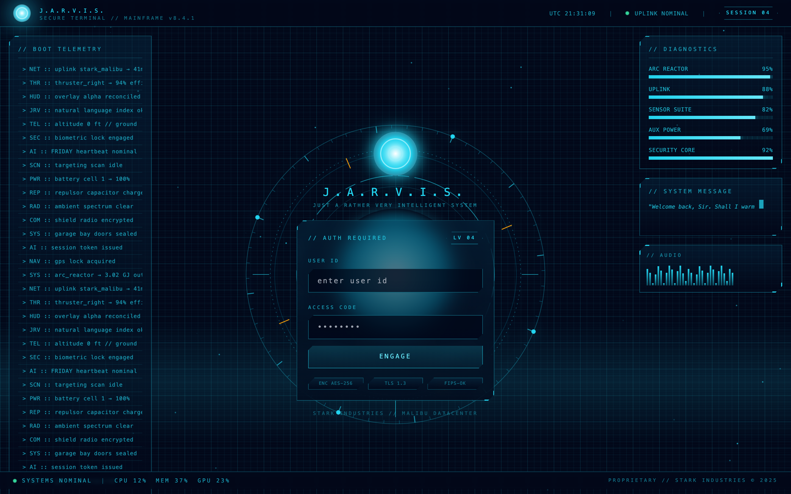
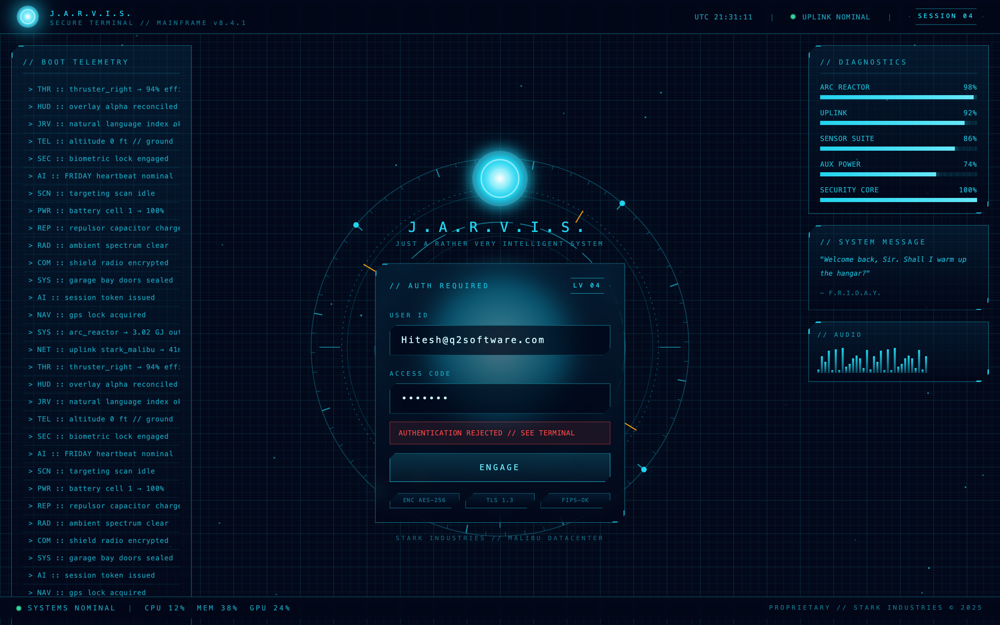
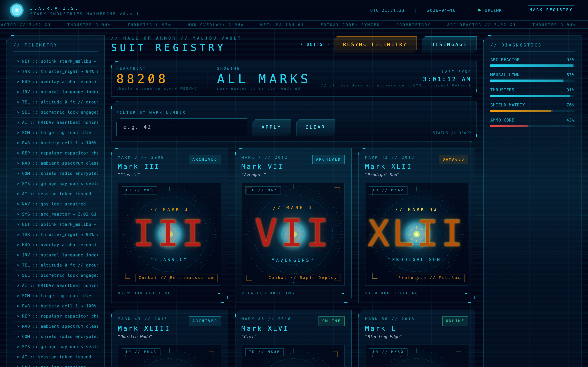
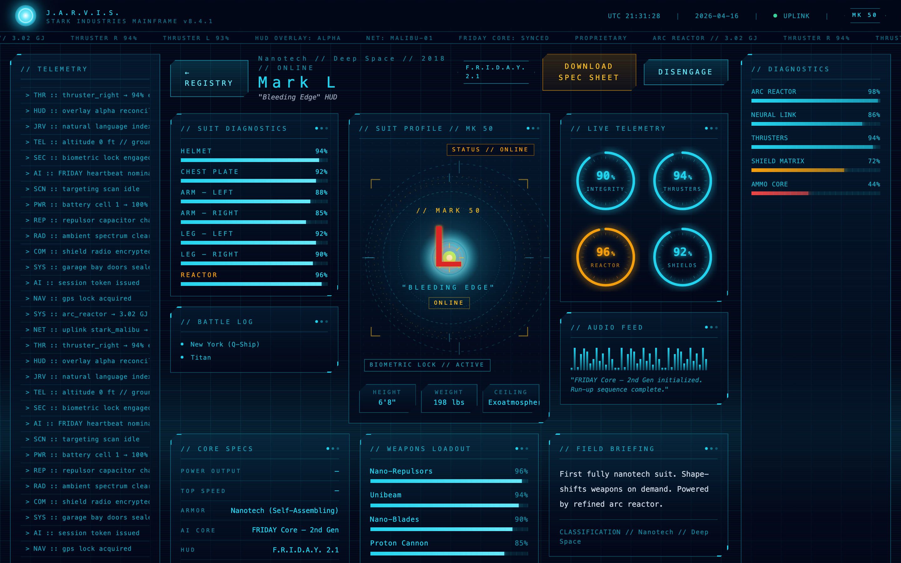
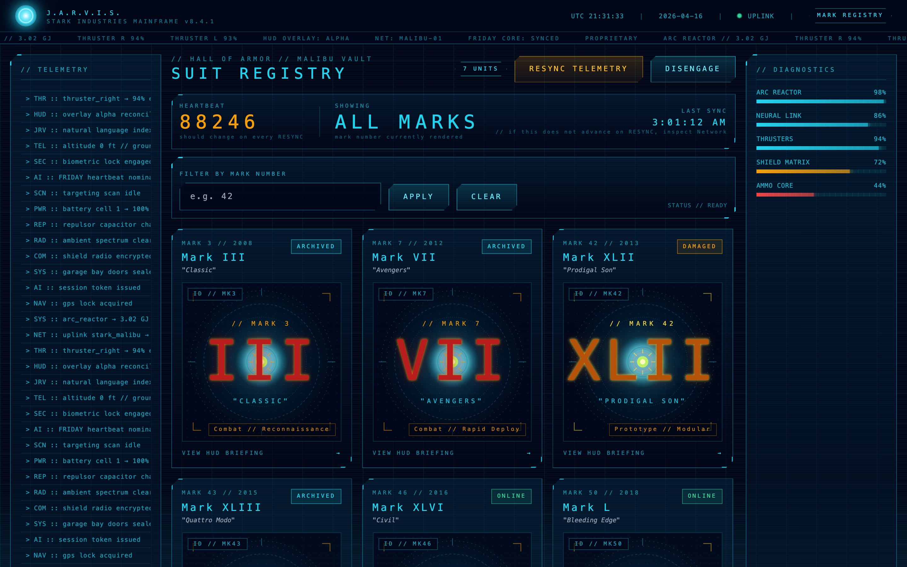
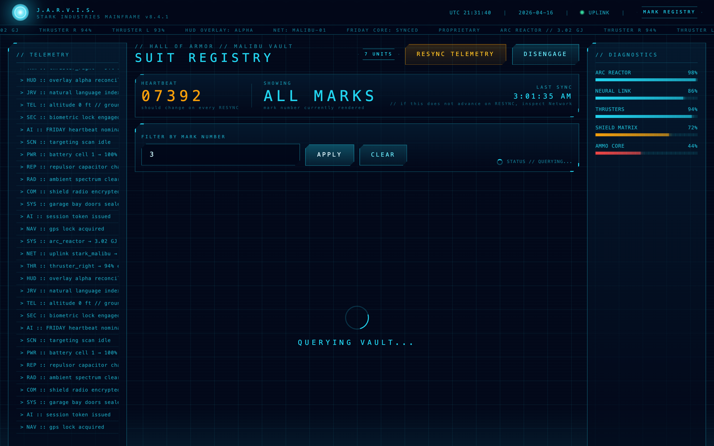
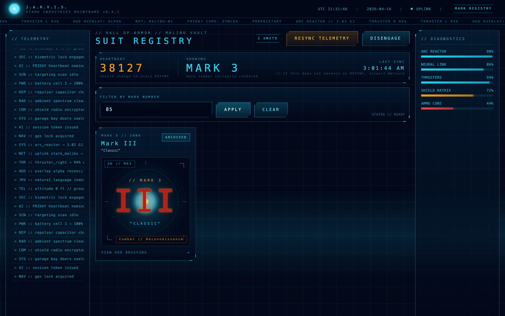
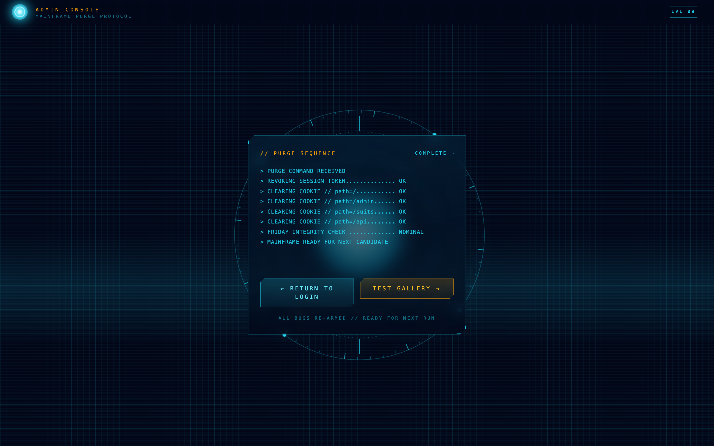

# Jarvis Debug Lab -- Interview Walkthrough

Five planted bugs, tiered by difficulty. All are real -- no mocks. The backend lives on Vercel, the bugs trigger identically whether the candidate runs it locally or against the production URL.

**Target URL:** https://jarvis-nine-coral.vercel.app
**Credentials:** `Hitesh@q2software.com` / `logeasy` (case matters -- see Bug 1)

**Candidate profile:** Hitesh Singh Solanki -- Backend Software Engineer, 3+ years at Q2 Software (Fintech). Python, FastAPI, PostgreSQL, Docker. Winner of Q2 AI Hackathon 2025. The bugs are tuned to test skills relevant to a backend engineer debugging a frontend integration.

The goal is to observe the candidate's diagnostic path, not whether they patch the code. Reward narration over result: which DevTools tab did they open, what did they look for, how did they form a hypothesis.

---

## Difficulty tiers

| # | Tier | Bug | Surface | Primary DevTools skill |
|---|---|---|---|---|
| 1 | **Easy** | Case-sensitive email on login | `/` | Network tab -- reading response body past a 200 OK |
| 2 | **Easy** | Cookie set on wrong path | `/suits` | Application tab -- Cookie attributes (Path) |
| 3 | **Medium** | snake_case vs camelCase field mismatch | `/suits/[id]` | Network tab -- comparing API payload vs rendered DOM |
| 4 | **Medium** | `HEARTBEAT` frozen after RESYNC | `/suits` | Application tab -- `localStorage` entry + silent Network tab on click |
| 5 | **Hard** | `SHOWING MARK` flips back on rapid APPLY | `/suits` | Network tab -- waterfall ordering + knowing about in-flight request cancellation |

No hints are printed to the Console. All signals live in **Network**, **Application**, or the visible UI state. The candidate has to choose which tab to open.

### Bug persistence model

Bugs are **sticky across logout/login** by design. Clicking `DISENGAGE` only clears the session cookie -- `localStorage` persists. When the candidate logs back in, Bug 4 is still live (the cached entry is still there, HEARTBEAT still frozen). The **only** way to clear Bug 4 mid-session is to hit `/api/admin/flush-cache`. Bug 5 needs no reset -- it reproduces on every rapid APPLY.

---

## API endpoints reference

| Method | Path | Purpose | Auth |
|---|---|---|---|
| `POST` | `/api/login` | Authenticate, set `jarvis_session` cookie (HttpOnly, **Path=/admin** -- Bug 2) | -- |
| `POST` | `/api/logout` | Clear session cookie | -- |
| `GET`  | `/api/suits` | List suits, optional `?mark=N` filter | Cookie required (401 otherwise) |
| `GET`  | `/api/suits/[id]` | Single suit detail | Cookie required |
| `GET`  | `/api/suits/[id]/spec` | CSV spec download (Content-Disposition set) | Cookie required |
| `POST` | `/api/admin/reset` | Purge `jarvis_session` cookie across paths | -- |
| `POST` | `/api/admin/grant` | Bypass login: issue a valid session for `hitesh@q2software.com` | -- |
| `POST` | `/api/admin/flush-cache` | Resolve Bug 4: returns `Clear-Site-Data: "cache"` | -- |

### Interviewer shortcuts

| Goal | URL to open in browser |
|---|---|
| Full reset, re-arm all bugs | `https://jarvis-nine-coral.vercel.app/admin/reset` |
| Skip login bugs 1+2, land straight in `/suits` | `https://jarvis-nine-coral.vercel.app/api/admin/grant` then navigate to `/suits` |
| Resolve Bug 4 mid-session without code changes | `https://jarvis-nine-coral.vercel.app/api/admin/flush-cache` |

`POST /api/admin/grant` and `/api/admin/flush-cache` also accept `GET` for convenience -- just paste the URL into the address bar.

---

## Bug 1 -- EASY -- Case-sensitive login

### Landing page (before trigger)



### Trigger
Candidate types `Hitesh@q2software.com` (capital H) with the correct password `logeasy`.

### Symptom
UI shows a red terminal error: `AUTHENTICATION REJECTED // SEE TERMINAL`. Generic -- no direct hint about case.



### What a candidate should find
Open **Network tab -> `POST /api/login`**. Status is **200 OK**, not 4xx. That's the trap: HTTP 200 does not imply business success. They have to open the **Response** panel:

```json
{
  "success": false,
  "error": "INVALID_CREDENTIALS",
  "detail": "EMAIL_CASE_MISMATCH: email comparison is case-sensitive on the server"
}
```

The `detail` field spells it out -- only visible if they bother reading the body.

### Where it lives
`app/api/login/route.ts`:

```ts
const user = USERS.find((u) => u.email === email && u.password === password);
```

### Resolution

**Candidate fix (code):**
```diff
- const user = USERS.find((u) => u.email === email && u.password === password);
+ const user = USERS.find(
+   (u) => u.email.toLowerCase() === String(email || "").toLowerCase()
+          && u.password === password,
+ );
```

**Interviewer shortcut (no redeploy):**
```
https://jarvis-nine-coral.vercel.app/api/admin/grant
```
That issues a clean session for `hitesh@q2software.com`. Then navigate to `/suits`.

### Signal rubric

| Behavior | Read |
|---|---|
| Opens Network tab within 15s of the failure | **Strong** |
| Reads the response body after seeing 200 | **Staff-level** |
| Stops at the Console tab (empty) | **Weak** |
| Retries "wrong password" variants | **Red flag** |

### Verify via curl
```bash
curl -s -X POST https://jarvis-nine-coral.vercel.app/api/login \
  -H "Content-Type: application/json" \
  -d '{"email":"Hitesh@q2software.com","password":"logeasy"}'
```
You should see `"success":false` with the `EMAIL_CASE_MISMATCH` detail, status 200.

---

## Bug 2 -- EASY -- Cookie set on wrong path

### Trigger
Candidate fixes Bug 1 (types `hitesh@q2software.com` lowercase). Login succeeds -- server responds `200 { success: true }` -- and the app redirects to `/suits`.

### Symptom
The suits gallery shows **`UNAUTHORIZED // SESSION TOKEN REJECTED BY /api/suits`**. The candidate just logged in successfully, yet the next page says unauthorized.



### What a candidate should find
Open **Application tab -> Cookies -> the domain**. The `jarvis_session` cookie exists, but its **Path** is `/admin`, not `/`. This means the browser only sends the cookie on requests to `/admin/*` paths -- requests to `/api/suits` (which lives under `/api`) never receive the cookie.

Open **Network tab -> `GET /api/suits`**. Look at the **Request Headers** -- there is no `Cookie` header. That's why the server returns 401.

**Why this matters for a backend engineer:** Cookie path scoping is a fundamental HTTP concept. Python backends (Flask, FastAPI) have identical behavior with `response.set_cookie(path=...)`. A backend dev should know that `Path=/admin` means the cookie is invisible to routes outside `/admin`.

### Where it lives
`app/api/login/route.ts`:

```ts
res.cookies.set(COOKIE_NAME, token, {
  httpOnly: true,
  sameSite: "lax",
  path: "/admin",    // <-- should be "/"
  maxAge: 60 * 60 * 8,
});
```

### Resolution

**Candidate fix (code):**
```diff
  res.cookies.set(COOKIE_NAME, token, {
    httpOnly: true,
    sameSite: "lax",
-   path: "/admin",
+   path: "/",
    maxAge: 60 * 60 * 8,
  });
```

**Interviewer shortcut (no redeploy):**
```
https://jarvis-nine-coral.vercel.app/api/admin/grant
```
This endpoint sets the cookie with `Path=/` -- bypassing Bug 2 entirely.

### Signal rubric

| Behavior | Read |
|---|---|
| Opens Application -> Cookies and inspects Path attribute | **Strong** |
| Checks Network -> Request Headers for missing Cookie | **Staff-level** |
| Says "the login worked but the cookie isn't being sent" | **Excellent** |
| Tries logging in again repeatedly | **Weak** |
| Blames CORS or "backend auth is broken" without checking cookie | **Red flag** |

---

## Bug 3 -- MEDIUM -- snake_case vs camelCase field mismatch

### Trigger
Navigate to any suit detail page (e.g., `/suits/mk50`). Look at the **CORE SPECS** panel in the bottom-left.

### Symptom
`POWER OUTPUT` and `TOP SPEED` fields show **"--"** (em dash). All other spec fields (ARMOR, AI CORE, HUD, FIRST DEPLOYED) display correctly.



### What a candidate should find
Open **Network tab -> `GET /api/suits/mk50`**. Inspect the **Response** payload:

```json
{
  "suit": {
    "power_output": "9.2 GW",
    "top_speed": "Mach 4.0",
    "armor": "Nanotech (Self-Assembling)",
    ...
  }
}
```

The API returns `power_output` (snake_case) and `top_speed` (snake_case). But the UI code reads `suit.powerOutput` and `suit.topSpeed` (camelCase) -- which are `undefined`, so the fallback `"--"` renders.

**Why this matters for a backend engineer:** This is the classic Python vs JavaScript naming convention mismatch. Python (and PostgreSQL) use `snake_case`; JavaScript uses `camelCase`. A backend engineer who ships APIs should immediately recognize this pattern. It's the single most common integration bug between Python backends and JS frontends.

### Where it lives
`app/suits/[id]/page.tsx`:

```tsx
<SpecRow label="POWER OUTPUT" value={(suit as any).powerOutput ?? "--"} />
<SpecRow label="TOP SPEED" value={(suit as any).topSpeed ?? "--"} />
```

### Resolution

**Candidate fix (code):**
```diff
- <SpecRow label="POWER OUTPUT" value={(suit as any).powerOutput ?? "--"} />
- <SpecRow label="TOP SPEED" value={(suit as any).topSpeed ?? "--"} />
+ <SpecRow label="POWER OUTPUT" value={suit.power_output} />
+ <SpecRow label="TOP SPEED" value={suit.top_speed} />
```

Alternative fix: add a mapping layer in the API or a transform function that converts snake_case keys to camelCase.

### Signal rubric

| Behavior | Read |
|---|---|
| Opens Network, compares API response fields to UI output | **Strong** |
| Immediately says "naming convention mismatch" | **Staff-level** |
| Proposes a serializer/transform layer as the proper fix | **Exceptional** |
| Checks Elements tab but doesn't look at Network payload | **Weak** |
| Assumes the API is missing fields | **Red flag** |

---

## Bug 4 -- MEDIUM -- Frozen HEARTBEAT after RESYNC

### Gallery after successful login



The header panel shows three prominent readouts: `HEARTBEAT` (5-digit random number -- server rerolls on every real fetch), `SHOWING` (mark currently rendered), and `LAST SYNC` (timestamp). Hint under HEARTBEAT: *"should change on every RESYNC"*.

### Trigger
Candidate logs in successfully, lands on `/suits`. They click **RESYNC TELEMETRY** in the top bar, then click it again.

### Symptom
The `HEARTBEAT` number does **not** change, no matter how many times RESYNC is clicked. `LAST SYNC` timestamp also stays frozen. Hard refresh (Cmd+Shift+R) does **not** fix it either -- the bug is in `localStorage`, not the HTTP cache, and survives soft and hard reloads until storage is cleared. **Logout then log back in: the bug is still live** -- `localStorage` isn't cleared by logout, so the cached blob (and its frozen heartbeat) is served on the next login too.

### What a candidate should find
This is **not** an HTTP cache bug (so DevTools "Disable cache" is irrelevant). The app stores responses in `localStorage` with a 24-hour TTL, and the RESYNC button re-reads from there.

Open **Network tab**, filter by `Fetch/XHR`, click RESYNC repeatedly. **No request fires.** That's signal #1 -- RESYNC isn't talking to the server.

Open **Application tab -> Local Storage -> the domain entry -> key `jarvis_suits_cache_v1`.** You'll see the cached blob:

```json
{
  "at": 1776013985095,
  "mark": "",
  "data": {
    "suits": [...],
    "server_timestamp": "2026-04-17T03:01:22.123Z",
    "heartbeat": 88246,
    "mark_queried": null
  }
}
```

The `at`, `server_timestamp`, and `heartbeat` never advance. The UI hint reads: *"if this does not advance on RESYNC, inspect Network"* -- intentionally misdirecting toward HTTP cache; the real answer lives in Application -> Storage. Logout/login cycle does not clear this entry.

### Where it lives
`app/suits/page.tsx`, in `loadSuits`:

```tsx
const raw = window.localStorage.getItem(CACHE_KEY);
if (raw) {
  const cached = JSON.parse(raw);
  if (cached.mark === mark && Date.now() - cached.at < CACHE_TTL_MS) {
    setSuits(cached.data.suits);
    setLastSync(cached.data.server_timestamp);
    return;  // <-- never fetches
  }
}
```

And in `resync`:
```tsx
async function resync() {
  await loadSuits(markApplied);  // forceNetwork not passed
}
```

### Resolution

**Candidate fix (code):** either drop the cache check entirely, or make `resync` bypass it.

```diff
  async function resync() {
-   await loadSuits(markApplied);
+   await loadSuits(markApplied, { forceNetwork: true });
  }
```

**Interviewer shortcut (no redeploy):** hit this URL
```
https://jarvis-nine-coral.vercel.app/api/admin/flush-cache
```
It returns `Clear-Site-Data: "cache", "storage"` which purges `localStorage` for the origin. Go back to `/suits`, reload the page once -- the cache is gone, a fresh fetch happens, `server_timestamp` advances.

**Candidate escape route without the endpoint:** Application -> Local Storage -> right-click `jarvis_suits_cache_v1` -> Delete. Same effect.

### Signal rubric

| Behavior | Read |
|---|---|
| Notices Network tab stays empty on RESYNC | **Good** |
| Opens Application -> Local Storage, finds `jarvis_suits_cache_v1` | **Strong** |
| Reads the cache entry and spots `at` / `server_timestamp` don't change | **Staff-level** |
| Reads the component source and finds the TTL / cache-check path | **Staff-level** |
| Clicks RESYNC repeatedly without opening Network | **Weak** |
| Assumes server bug and ignores client-side storage | **Red flag** |

### Verify the cache entry is really in localStorage
In DevTools Console while on `/suits`:
```js
JSON.parse(localStorage.getItem("jarvis_suits_cache_v1"))
```
You should see `{ at, mark, data: { suits, server_timestamp } }`. Click RESYNC a few times, rerun the line -- the `at` timestamp is unchanged.

---

## Bug 5 -- HARD -- Race condition on filter

### Trigger
On `/suits`, type `3` in the filter and click **APPLY**. The request hangs (~5s -- long enough to say *"that's taking forever, try 85"*). Before it returns, clear the input, type `85`, click **APPLY**. The mark=85 response returns in ~200ms and `SHOWING MARK 85` renders. ~1-2 s later the mark=3 response finally returns and clobbers state -- UI flips back to `SHOWING MARK 3`.

### Symptom
The prominent `SHOWING MARK N` readout in the header shows `MARK 85` for a few seconds -> then **flips back to `MARK 3`** without the candidate touching anything. Final rendered result does not match the last APPLY.

Mid-flight (after first APPLY has been issued, before its response arrives):



Final state (the slower earlier request has arrived and overwritten the newer Mark 85 result):



Notice the filter input still says `85`, but the header shows `SHOWING MARK 3` and only Mark III appears. The stale response overwrote the newer result.

### Live latency proof from the deploy

```json
{ "mark3_ms": 5000, "mark85_ms": 220 }
```

Mark 3 is ~20x slower than Mark 85. Curve is quadratic on `(91 - clamped) / 90`. The gap is tuned so `SHOWING MARK 85` is visible for ~1-2 s before the stranded mark=3 response clobbers it.

### Reproducing reliably
1. Type `3` in the filter -> click **APPLY**. `QUERYING VAULT...` spinner appears.
2. **Within ~1 second** (before Mark 3 finishes), clear the input, type `85`, click APPLY.
3. Watch: UI shows `SHOWING MARK 85` briefly, then visibly flips back to `SHOWING MARK 3` a second or two later. That flip is the bug.

### What a candidate should find
Open **Network tab -> Fetch/XHR**, repeat the reproduction. Two requests show up:

- `suits?mark=3` -- **~5s** total time (still pending when mark=85 completes)
- `suits?mark=85` -- **~200ms** total time

Look at the **Waterfall** column. The 85 request returns almost instantly (the user sees Mark 85 briefly). The 3 request returns ~2 seconds later -- and its response is written to state last, overwriting Mark 85.

Subtle clue in the backend: `/api/suits` applies a per-mark latency that is **inverse** to the mark number. Smaller mark = slower. The candidate doesn't need to find this to diagnose -- the waterfall is enough -- but explaining it is a staff signal.

Core insight the candidate must name: **there is no request cancellation**. The in-flight fetch for Mark 3 is never aborted when Mark 85 is requested, so its late response clobbers state.

### Where it lives
`app/suits/page.tsx`:

```tsx
useEffect(() => {
  loadSuits(markApplied);
  // intentionally no AbortController
}, [markApplied]);
```

### Resolution

**Candidate fix (code):**
```diff
  useEffect(() => {
-   loadSuits(markApplied);
+   const controller = new AbortController();
+   loadSuits(markApplied, controller.signal);
+   return () => controller.abort();
  }, [markApplied]);
```
Plus thread the `signal` into `fetch(...)` inside `loadSuits`.

Alternative fix: a response-time monotonic counter (increment on each call, ignore responses whose counter is not the latest).

**No session-level bypass endpoint.** The race condition is the test -- there is no `/api/admin/linearize` by design. If the candidate gets stuck and time is short, reload the page to reset state, or skip to the summary.

### Signal rubric

| Behavior | Read |
|---|---|
| Opens Network and compares timings / waterfall | **Good** |
| Names "race condition" or "last-response-wins" | **Strong** |
| Proposes AbortController or a request-id guard | **Staff-level** |
| Notices response timing inversely correlates with mark | **Exceptional** |
| Concludes "the backend is flaky" | **Red flag** |

### Verify via curl (shows the latency gradient)
```bash
# Should take ~5s
time curl -s -o /dev/null -H "Cookie: jarvis_session=<...>" \
  "https://jarvis-nine-coral.vercel.app/api/suits?mark=3"

# Should take ~220ms
time curl -s -o /dev/null -H "Cookie: jarvis_session=<...>" \
  "https://jarvis-nine-coral.vercel.app/api/suits?mark=85"
```

---

## Interviewer flow (30 min)

| t | Action | Expected candidate move |
|---|---|---|
| 0:00 | Share URL + credentials. "Log in, explore, narrate as you go." | -- |
| 0:00-0:03 | Watch them type `Hitesh@q2software.com` -> Bug 1 triggers | Network tab -> response body |
| 0:03-0:05 | If stuck, nudge: "what does the server actually say?" | They read the `detail` field |
| 0:05 | They type lowercase, login succeeds but `/suits` shows UNAUTHORIZED -> Bug 2 | Application tab -> Cookies -> Path |
| 0:07 | If stuck: "the login worked -- where did the session go?" | They check cookie attributes |
| 0:08 | Use `/api/admin/grant` to bypass, navigate to `/suits` | Gallery loads |
| 0:09 | "Click on a suit -- anything look off?" -> Bug 3 | Network tab -> API payload comparison |
| 0:12 | If stuck: "compare the API response to what's rendered" | They spot snake_case vs camelCase |
| 0:14 | "Go back to the gallery and click RESYNC a few times" -> Bug 4 | Network tab -> no request -> Application -> localStorage |
| 0:18 | If stuck: "what does the browser do if you hard-refresh?" | They make the cache connection |
| 0:20 | "Filter by Mark 3, then quickly filter by Mark 85" -> Bug 5 | Network tab -> waterfall -> race condition |
| 0:25 | If they nail it early, ask: "how would you fix it?" | AbortController / request-id guard |
| 0:28 | Wrap: "which would you prioritize fixing first, and why?" | Judge prioritization |

### Pass bar

- **Strong:** Diagnoses 3+ of 5 bugs cleanly, including at least one of Bug 3/4/5, and names the correct DevTools artifact for each. Proposes a concrete fix for at least one medium/hard bug.
- **Pass:** Diagnoses Bug 1 and Bug 2 without major prompts, and makes progress on at least one medium bug.
- **Fail:** Opens only Console. Blames backend without looking at response body/headers. Refreshes in a loop without reading network activity.

### Red flag phrases
- "It's a backend issue" (without opening Network).
- "The cache tab is empty so there's no cache problem" (Application -> Cache Storage != HTTP cache).
- "The API fields look fine" (without comparing them to what the UI reads).
- "The response looks the same so the request must be wrong" (on Bug 5 -- misses that *order* of responses is what matters, not content).

### Why these bugs for Hitesh's profile

| Bug | Tests | Relevance to Backend Engineer |
|---|---|---|
| 1 (email case) | Response body inspection | API error handling -- 200 with error body is a common pattern in REST APIs |
| 2 (cookie path) | Cookie/header inspection | HTTP fundamentals -- cookie scoping, directly maps to `set_cookie(path=...)` in Flask/FastAPI |
| 3 (snake_case) | Payload vs UI comparison | Python vs JS naming conventions -- the #1 integration friction point |
| 4 (cache) | Network + Storage tabs | Client-side caching layers -- mirrors Redis/DB cache invalidation debugging |
| 5 (race) | Network waterfall | Concurrency -- race conditions in async systems, directly maps to asyncio/celery patterns |

---

## Reset between candidates

Open in a new tab:

```
https://jarvis-nine-coral.vercel.app/admin/reset
```

That purges the session cookie and flushes the browser cache (via the reset page's own Clear-Site-Data header). All five bugs re-arm immediately.



---

## Local dev (optional)

```bash
git clone https://github.com/telladheerajnaidu/jarvis
cd jarvis
npm install
npm run dev
# http://localhost:3000
```

Bugs behave identically on localhost.
