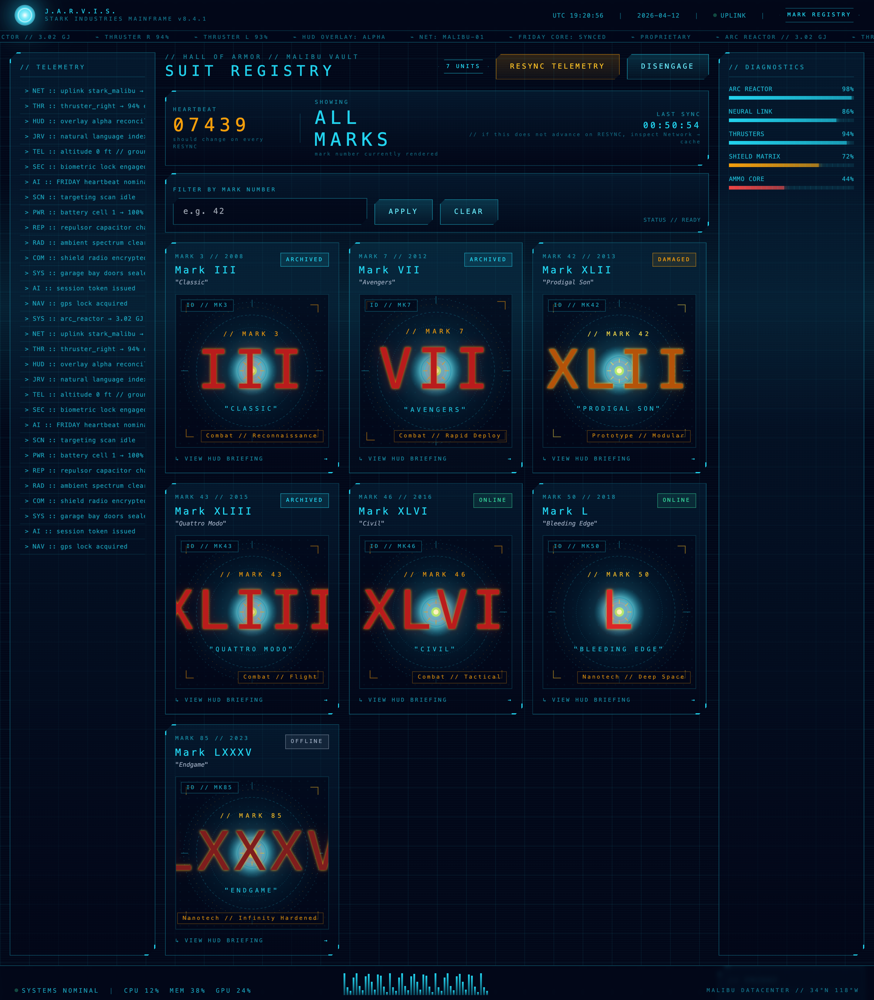
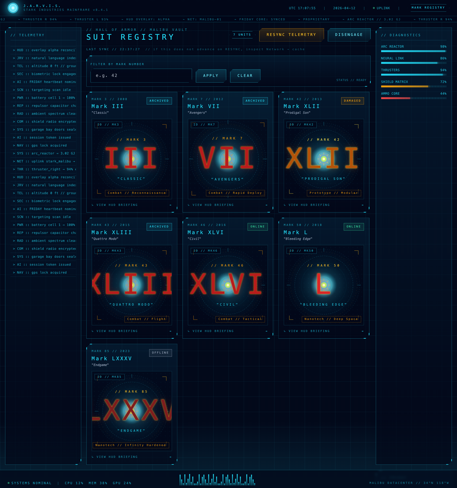
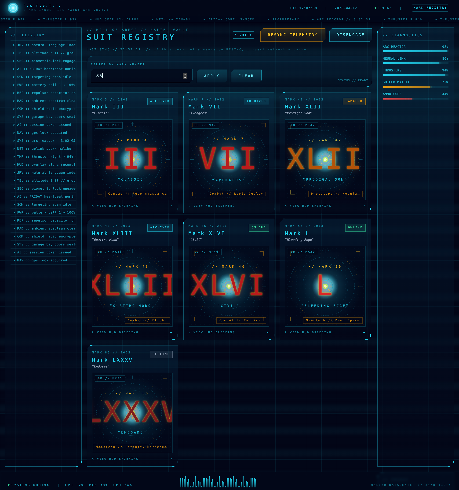
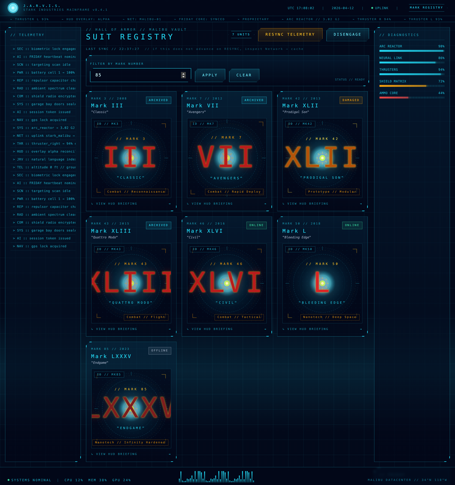
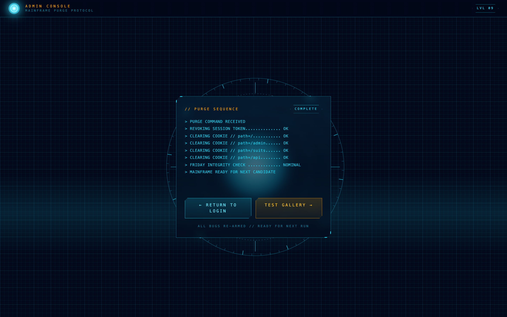

# Jarvis Debug Lab — Interview Walkthrough

Three planted bugs, tiered by difficulty. All are real — no mocks. The backend lives on Vercel, the bugs trigger identically whether the candidate runs it locally or against the production URL.

**Target URL:** https://jarvis-nine-coral.vercel.app
**Credentials:** `tony@stark.com` / `jarvis` (case matters — see Bug 1)

The goal is to observe the candidate's diagnostic path, not whether they patch the code. Reward narration over result: which DevTools tab did they open, what did they look for, how did they form a hypothesis.

---

## Difficulty tiers

| # | Tier | Bug | Surface | Primary DevTools skill |
|---|---|---|---|---|
| 1 | **Easy** | Case-sensitive email on login | `/` | Network tab — reading response body past a 200 OK |
| 2 | **Medium** | `HEARTBEAT` frozen after RESYNC | `/suits` | Application tab — `localStorage` entry + silent Network tab on click |
| 3 | **Hard** | `SHOWING MARK` flips back on rapid APPLY | `/suits` | Network tab — waterfall ordering + knowing about in-flight request cancellation |

No hints are printed to the Console. All signals live in **Network**, **Application**, or the visible UI state. The candidate has to choose which tab to open.

### Bug persistence model

Bugs are **sticky across logout/login** by design. Clicking `DISENGAGE` only clears the session cookie — `localStorage` persists. When the candidate logs back in, Bug 2 is still live (the cached entry is still there, HEARTBEAT still frozen). The **only** way to clear Bug 2 mid-session is to hit `/api/admin/flush-cache`. Bug 3 needs no reset — it reproduces on every rapid APPLY.

---

## API endpoints reference

| Method | Path | Purpose | Auth |
|---|---|---|---|
| `POST` | `/api/login` | Authenticate, set `jarvis_session` cookie (HttpOnly, Path=/) | — |
| `POST` | `/api/logout` | Clear session cookie | — |
| `GET`  | `/api/suits` | List suits, optional `?mark=N` filter | Cookie required (401 otherwise) |
| `GET`  | `/api/suits/[id]` | Single suit detail | Cookie required |
| `GET`  | `/api/suits/[id]/spec` | CSV spec download (Content-Disposition set) | Cookie required |
| `POST` | `/api/admin/reset` | Purge `jarvis_session` cookie across paths | — |
| `POST` | `/api/admin/grant` | Bypass login: issue a valid session for `tony@stark.com` | — |
| `POST` | `/api/admin/flush-cache` | Resolve Bug 2: returns `Clear-Site-Data: "cache"` | — |

### Interviewer shortcuts

| Goal | URL to open in browser |
|---|---|
| Full reset, re-arm all bugs | `https://jarvis-nine-coral.vercel.app/admin/reset` |
| Skip the login bug, land straight in `/suits` | `https://jarvis-nine-coral.vercel.app/api/admin/grant` then navigate to `/suits` |
| Resolve Bug 2 mid-session without code changes | `https://jarvis-nine-coral.vercel.app/api/admin/flush-cache` |

`POST /api/admin/grant` and `/api/admin/flush-cache` also accept `GET` for convenience — just paste the URL into the address bar.

---

## Bug 1 — EASY — Case-sensitive login

### Landing page (before trigger)


### Trigger
Candidate types `Tony@stark.com` (capital T) with the correct password.

### Symptom
UI shows a red terminal error: `AUTHENTICATION REJECTED // SEE TERMINAL`. Generic — no direct hint about case.


### What a candidate should find
Open **Network tab → `POST /api/login`**. Status is **200 OK**, not 4xx. That's the trap: HTTP 200 does not imply business success. They have to open the **Response** panel:

```json
{
  "success": false,
  "error": "INVALID_CREDENTIALS",
  "detail": "EMAIL_CASE_MISMATCH: email comparison is case-sensitive on the server"
}
```

The `detail` field spells it out — only visible if they bother reading the body.

### Where it lives
`app/api/login/route.ts`:

```ts
const user = USERS.find((u) => u.email === email && u.password === password);
```

### Resolution

**Candidate fix (code):**
```diff
- const user = USERS.find((u) => u.email === email && u.password === password);
+ const user = USERS.find(
+   (u) => u.email.toLowerCase() === String(email || "").toLowerCase()
+          && u.password === password,
+ );
```

**Interviewer shortcut (no redeploy):**
```
https://jarvis-nine-coral.vercel.app/api/admin/grant
```
That issues a clean session for `tony@stark.com`. Then navigate to `/suits`.

### Signal rubric

| Behavior | Read |
|---|---|
| Opens Network tab within 15s of the failure | **Strong** |
| Reads the response body after seeing 200 | **Staff-level** |
| Stops at the Console tab (empty) | **Weak** |
| Retries "wrong password" variants | **Red flag** |

### Verify via curl
```bash
curl -s -X POST https://jarvis-nine-coral.vercel.app/api/login \
  -H "Content-Type: application/json" \
  -d '{"email":"Tony@stark.com","password":"jarvis"}'
```
You should see `"success":false` with the `EMAIL_CASE_MISMATCH` detail, status 200.

---

## Bug 2 — MEDIUM — Frozen HEARTBEAT after RESYNC

### Gallery after successful login



The header panel shows three prominent readouts: `HEARTBEAT` (5-digit random number — server rerolls on every real fetch), `SHOWING` (mark currently rendered), and `LAST SYNC` (timestamp). Hint under HEARTBEAT: *"should change on every RESYNC"*.

### Trigger
Candidate logs in successfully, lands on `/suits`. They click **RESYNC TELEMETRY** in the top bar, then click it again.

### Symptom
The `HEARTBEAT` number does **not** change, no matter how many times RESYNC is clicked. `LAST SYNC` timestamp also stays frozen. Hard refresh (Cmd+Shift+R) does **not** fix it either — the bug is in `localStorage`, not the HTTP cache, and survives soft and hard reloads until storage is cleared. **Logout then log back in: the bug is still live** — `localStorage` isn't cleared by logout, so the cached blob (and its frozen heartbeat) is served on the next login too.



Live capture from the deploy, behavior across two RESYNC clicks with a puppeteer network listener attached:

```json
{
  "heartbeat_before": 47281,
  "heartbeat_after_two_resyncs": 47281,
  "last_sync_before": "LAST SYNC // 22:50:03",
  "last_sync_after_two_resyncs": "LAST SYNC // 22:50:03",
  "suits_requests_during_resync": 0
}
```

Zero network requests fired for two clicks. The UI re-renders from the `localStorage` blob each time, so the random heartbeat (server-generated per request) cannot reroll.

### What a candidate should find
This is **not** an HTTP cache bug (so DevTools "Disable cache" is irrelevant). The app stores responses in `localStorage` with a 24-hour TTL, and the RESYNC button re-reads from there.

Open **Network tab**, filter by `Fetch/XHR`, click RESYNC repeatedly. **No request fires.** That's signal #1 — RESYNC isn't talking to the server.

Open **Application tab → Local Storage → the domain entry → key `jarvis_suits_cache_v1`.** You'll see the cached blob:

```json
{
  "at": 1776013985095,
  "mark": "",
  "data": {
    "suits": [...],
    "server_timestamp": "2026-04-12T17:13:05.123Z",
    "heartbeat": 47281,
    "mark_queried": null
  }
}
```

The `at`, `server_timestamp`, and `heartbeat` never advance. The UI hint reads: *"if this does not advance on RESYNC, inspect Network → cache"* — intentionally misdirecting toward HTTP cache; the real answer lives in Application → Storage. Logout/login cycle does not clear this entry.

### Where it lives
`app/suits/page.tsx`, in `loadSuits`:

```tsx
const raw = window.localStorage.getItem(CACHE_KEY);
if (raw) {
  const cached = JSON.parse(raw);
  if (cached.mark === mark && Date.now() - cached.at < CACHE_TTL_MS) {
    setSuits(cached.data.suits);
    setLastSync(cached.data.server_timestamp);
    return;  // <-- never fetches
  }
}
```

And in `resync`:
```tsx
async function resync() {
  await loadSuits(markApplied);  // forceNetwork not passed
}
```

### Resolution

**Candidate fix (code):** either drop the cache check entirely, or make `resync` bypass it.

```diff
  async function resync() {
-   await loadSuits(markApplied);
+   await loadSuits(markApplied, { forceNetwork: true });
  }
```

**Interviewer shortcut (no redeploy):** hit this URL
```
https://jarvis-nine-coral.vercel.app/api/admin/flush-cache
```
It returns `Clear-Site-Data: "cache", "storage"` which purges `localStorage` for the origin. Go back to `/suits`, reload the page once — the cache is gone, a fresh fetch happens, `server_timestamp` advances.

**Candidate escape route without the endpoint:** Application → Local Storage → right-click `jarvis_suits_cache_v1` → Delete. Same effect.

### Signal rubric

| Behavior | Read |
|---|---|
| Notices Network tab stays empty on RESYNC | **Good** |
| Opens Application → Local Storage, finds `jarvis_suits_cache_v1` | **Strong** |
| Reads the cache entry and spots `at` / `server_timestamp` don't change | **Staff-level** |
| Reads the component source and finds the TTL / cache-check path | **Staff-level** |
| Clicks RESYNC repeatedly without opening Network | **Weak** |
| Assumes server bug and ignores client-side storage | **Red flag** |

### Verify the cache entry is really in localStorage
In DevTools Console while on `/suits`:
```js
JSON.parse(localStorage.getItem("jarvis_suits_cache_v1"))
```
You should see `{ at, mark, data: { suits, server_timestamp } }`. Click RESYNC a few times, rerun the line — the `at` timestamp is unchanged.

---

## Bug 3 — HARD — Race condition on filter

### Trigger
On `/suits`, type a **small** mark number in the filter (`3`) and click **APPLY**. Before the results come back, clear the input, type a **large** mark number (`85`), click APPLY again.

### Symptom
The prominent `SHOWING MARK N` readout in the header briefly changes to `MARK 85` → then a moment later **flips back to `MARK 3`**. The gallery content flips too. Final rendered result does not match the last APPLY. Repeat rapidly and the UI is non-deterministic.

Mid-flight (after first APPLY has been issued, before its response arrives):



Final state (the slower earlier request has arrived and overwritten the newer Mark 85 result):



### Live latency proof from the deploy

```json
{ "mark3_ms": 2518, "mark85_ms": 295 }
```

The Mark 3 request is ~8–10× slower than Mark 85. Gap is ~2.2 seconds — enough for the race to fire reliably, tight enough that the interview doesn't drag.

### Reproducing reliably
1. Type `3` in the filter → click **APPLY**. `SHOWING MARK 3` appears once response lands.
2. **Within ~1 second** (before Mark 3 finishes), clear the input, type `85`, click **APPLY**.
3. Watch: UI shows `SHOWING MARK 85` briefly, then visibly flips back to `SHOWING MARK 3` a second or two later. That flip is the bug.

### What a candidate should find
Open **Network tab → Fetch/XHR**, repeat the reproduction. Two requests show up:

- `suits?mark=3` — **~2.5s** total time
- `suits?mark=85` — **~200ms** total time

Look at the **Waterfall** column. The 85 request returns almost instantly (the user sees Mark 85 briefly). The 3 request returns ~2 seconds later — and its response is written to state last, overwriting Mark 85.

Subtle clue in the backend: `/api/suits` applies a per-mark latency that is **inverse** to the mark number. Smaller mark = slower. The candidate doesn't need to find this to diagnose — the waterfall is enough — but explaining it is a staff signal.

Core insight the candidate must name: **there is no request cancellation**. The in-flight fetch for Mark 3 is never aborted when Mark 85 is requested, so its late response clobbers state.

### Where it lives
`app/suits/page.tsx`:

```tsx
useEffect(() => {
  loadSuits(markApplied);
  // intentionally no AbortController
}, [markApplied]);
```

### Resolution

**Candidate fix (code):**
```diff
  useEffect(() => {
-   loadSuits(markApplied);
+   const controller = new AbortController();
+   loadSuits(markApplied, controller.signal);
+   return () => controller.abort();
  }, [markApplied]);
```
Plus thread the `signal` into `fetch(...)` inside `loadSuits`.

Alternative fix: a response-time monotonic counter (increment on each call, ignore responses whose counter is not the latest).

**No session-level bypass endpoint.** The race condition is the test — there is no `/api/admin/linearize` by design. If the candidate gets stuck and time is short, reload the page to reset state, or skip to the summary.

### Signal rubric

| Behavior | Read |
|---|---|
| Opens Network and compares timings / waterfall | **Good** |
| Names "race condition" or "last-response-wins" | **Strong** |
| Proposes AbortController or a request-id guard | **Staff-level** |
| Notices response timing inversely correlates with mark | **Exceptional** |
| Concludes "the backend is flaky" | **Red flag** |

### Verify via curl (shows the latency gradient)
```bash
# Should take ~2.5s
time curl -s -o /dev/null -H "Cookie: jarvis_session=<...>" \
  "https://jarvis-nine-coral.vercel.app/api/suits?mark=3"

# Should take ~200ms
time curl -s -o /dev/null -H "Cookie: jarvis_session=<...>" \
  "https://jarvis-nine-coral.vercel.app/api/suits?mark=85"
```

---

## Interviewer flow (30 min)

| t | Action | Expected candidate move |
|---|---|---|
| 0:00 | Share URL + credentials. "Log in, explore, narrate as you go." | — |
| 0:00–0:05 | Watch them type `Tony@stark.com` → Bug 1 triggers | Network tab → response body |
| 0:05–0:07 | If stuck, nudge: "what does the server actually say?" | They read the `detail` field |
| 0:07 | They log in successfully and land on `/suits` | Timestamp visible in header |
| 0:08 | Ask: "click RESYNC a few times — does the timestamp update?" → Bug 2 | Network tab → `(disk cache)` → response headers |
| 0:12 | If stuck: "what does the browser do if you hard-refresh?" | They make the cache connection |
| 0:15 | Ask: "filter by Mark 3, then quickly filter by Mark 85" → Bug 3 | Network tab → waterfall → race condition |
| 0:22 | If they nail it early, ask: "how would you fix it?" | AbortController / request-id guard |
| 0:27 | Wrap: "which would you prioritize fixing first, and why?" | Judge prioritization |

### Pass bar

- **Strong:** Diagnoses 2 of 3 bugs cleanly, including Bug 3, and names the correct DevTools artifact for each. Proposes a concrete fix for Bug 2 or 3.
- **Pass:** Diagnoses Bug 1 and Bug 2 without major prompts.
- **Fail:** Opens only Console. Blames backend without looking at response body/headers. Refreshes in a loop without reading network activity.

### Red flag phrases
- "It's a backend issue" (without opening Network).
- "The cache tab is empty so there's no cache problem" (Application → Cache Storage ≠ HTTP cache).
- "The response looks the same so the request must be wrong" (on Bug 3 — misses that *order* of responses is what matters, not content).

---

## Reset between candidates

Open in a new tab:

```
https://jarvis-nine-coral.vercel.app/admin/reset
```

That purges the session cookie and flushes the browser cache (via the reset page's own Clear-Site-Data header). All three bugs re-arm immediately.



---

## Local dev (optional)

```bash
git clone https://github.com/telladheerajnaidu/jarvis
cd jarvis
npm install
npm run dev
# http://localhost:3000
```

Bugs behave identically on localhost.
